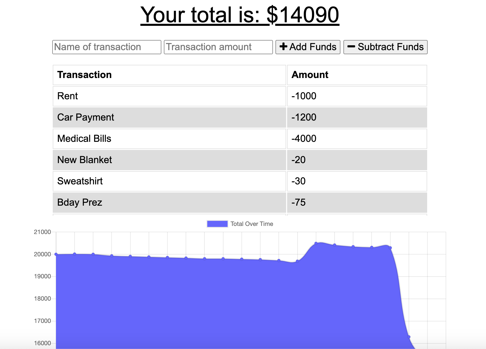

# offline-budget-tracker
This repository contains the code for a budget tracker where you can log your expenses whether you have access to the internet or not.  
## Description
The ask for this challenge was to take the budget app and make sure that the user could enter expenses in offline mode. If an expense is enterred while the user is offline then once the user comes back online the expense should be added to the database. 

This meant using IndexedDB and Cache Storage, as well as using manifest.json and registering a service worker.

## Additional Information
### Notes
Most of the offline and PWA functionality is straightforward and can be leveraged from other applications, the more difficult part is ensuring your data is caching properly, there isn't leftover data causing errors, and that you stick to your naming convention. 

Important Note: If the user is in offline mode and they refresh the page then there are errors as the app cannot use any GET functions when it's offline. 

### Screenshot

### Access Application

* https://github.com/IsiBee/offline-budget-tracker - Github Repo
* https://sheltered-coast-35610.herokuapp.com/ - Deployed App